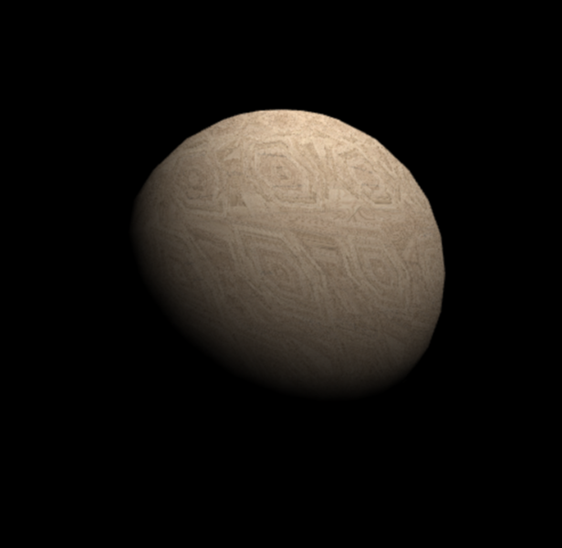
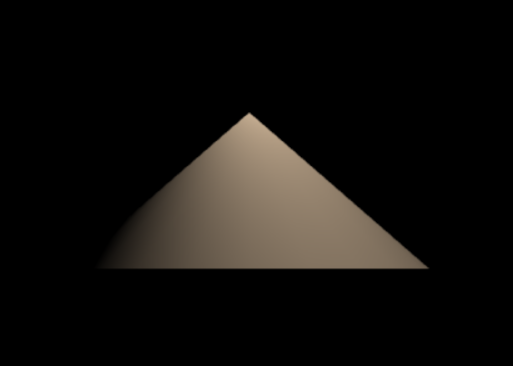
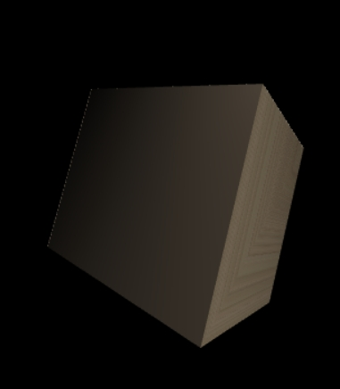
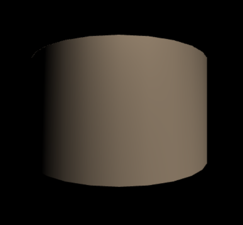
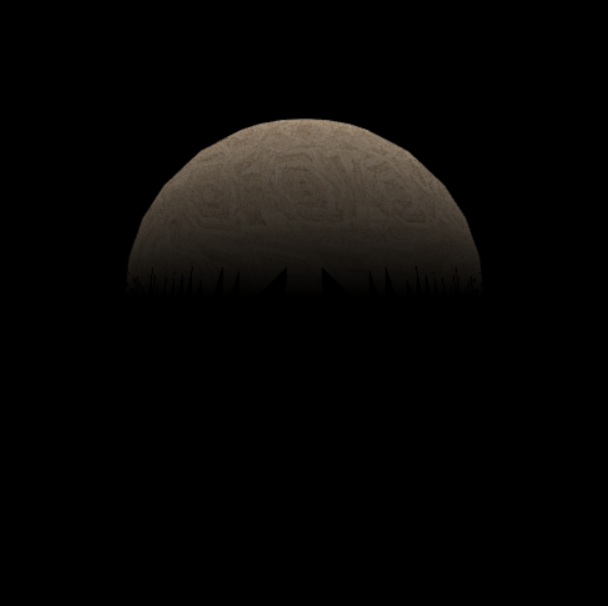
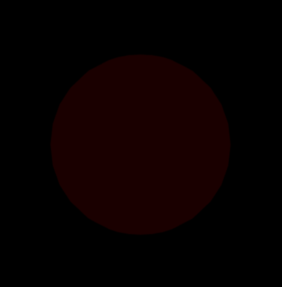
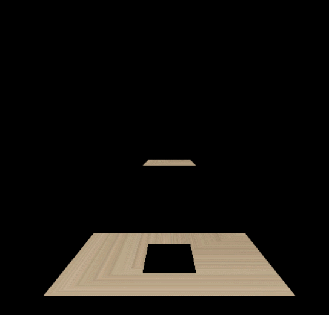

# ezgl

### Step 1: create a new scene
```ts
const scene = new Scene();
```

### Step 2: create shape
```ts
const sphereShape = new Sphere(Transform.translate(0, 0, -10), Transform.translate(0, 0, 10), 5);

```

### Step 3: create material and set texture
```ts
const sphereMat = new PhongMaterial();
// set texture by color or url
// sphereMat.map.color = [1, 0, 0]; red
sphereMat.map.url = '/wood.jpg';
```

### Step 4: create primitive by shape and material
```ts
const spherePrimitive = new Primitive(sphereShape, sphereMat);
```

### Step 5: add primitives into the scene
```ts
scene.primitives = [ spherePrimitive ];
```

### Step 6: set lights for the scene

### Step 5: add camera

### Step 6: start to render

### Demo

* 形状类

  球体
  

  圆锥
  

  立方体
  

  圆柱体
  

* 点光源

  
  
* 直线光源
  
* 环境光源

  

* 镜头移动和实时阴影

  